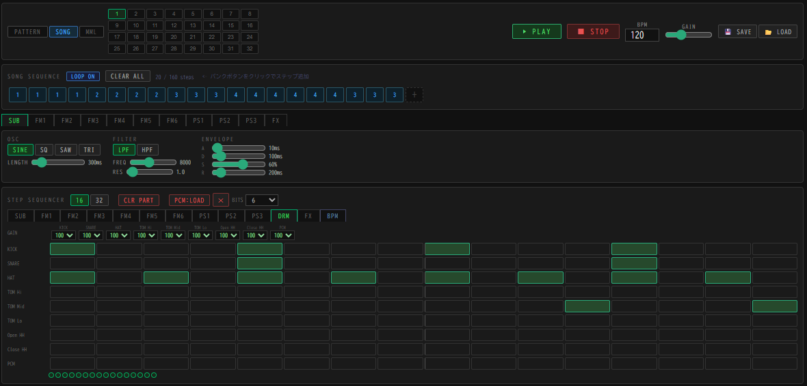

# EM-224 ( honodori )
A browser‑based hybrid synthesizer and sequencer integrating FM, PSG, subtractive, and drum/PCM engines.

---

## 🎹 Overview

**honodori** is a multi‑engine synthesizer and sequencer that runs entirely in the browser.  
It combines **FM**, **PSG**, **SUB (subtractive)**, and **DRM (drum + PCM loader)** sound sources,  
and supports both **GUI‑based composition** and **MML scripting**.

It is designed for chiptune creators, sound designers, and anyone exploring retro‑inspired electronic music.

---

## 🚀 Features

### 🔊 Hybrid Sound Architecture
- **SUB** — subtractive synthesis (SINE / SQUARE / SAW / TRIANGLE, ADSR, LPF/HPF)
- **FM** — 4‑operator engine with 8 algorithms  
  - Operator parameters: AR / DR / SR / RR / SL / TL / KS / MUL / DT  
  - Feedback, tone bank support
- **PSG** — AY‑style extended PSG  
  - Waveforms: SQ / SAW / TRI / SIN  
  - Detune, envelope types, LFO (wave / rate / depth / destination)
- **DRM** — drum engine + PCM loader  
  - 8 fixed drum sounds + 1 PCM channel  
  - PCM supports WAV/MP3 loading (6‑bit lo‑fi conversion)

---

## 🎼 Composition Modes

### **PATTERN Mode**
- 16/32‑step sequencer  
- Note, volume, pan, tie, step length  
- Per‑engine parameter editing

### **SONG Mode**
- Arrange multiple patterns to build full tracks  
- Pattern chaining and structure editing

### **MML Mode**
- Supports note input (CDEFGAB), rests (R), note length, octave, tempo, velocity  
- PAN, TIE, tone selection  
- Partially MUCOM88‑compatible syntax  
- Executes independently from PATTERN/SONG modes

---

## 🥁 Drum MML

Drum channels support a dedicated MML syntax:

- `%KICK`, `%SNARE`, `%HHAT`, `%OH`, `%CH`, `%THTOM`, `%TMTOM`, `%TLTOM`
- `%PPCM` — play PCM sample
- Note length can be specified (`%KICK4`) or inherit the default `L` value

Example:%KICK4 %SNARE8 %HHAT16 %HHAT16 %PPCM4

---

## 🎛️ Effects & Mixer

- **Delay** (sync‑able)
- **Chorus**
- **DJ Filter** (LPF / HPF)
- Per‑engine **PAN** and **GAIN**

---

## 💾 Save & Load

- Projects can be saved and loaded directly in the browser  
- No installation required

---

## 📂 Project Structure
index.html     - main application

---

## 🧪 Demo

Live demo:  
https://ufotone.github.io/github.io/

Open index.html in your browser.
No build step required.
---

